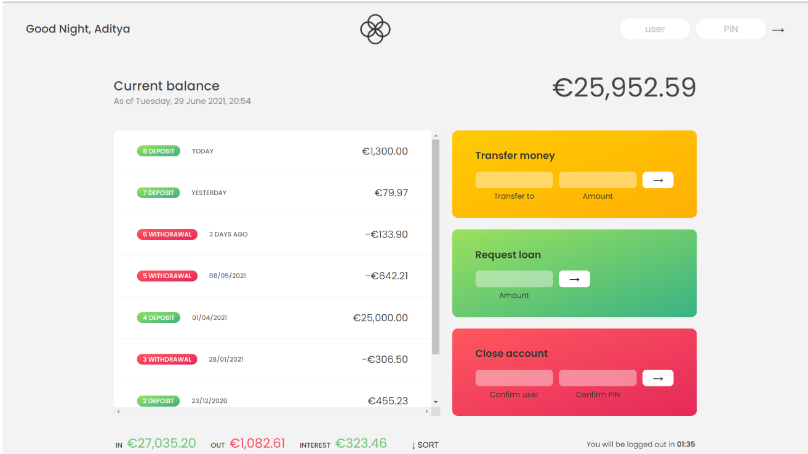

 

  

  <h1 align="center">Bankist </h1>

  
Table of contents

  <ol>
    <li>
      <a href="#about-the-project">About The Project</a>
    </li>
    <li><a href="#screenshot">Screenshot</a></li>
    <li><a href="#link-to-website">Link to website</a></li>
    <li><a href="#features">Features </a></li>
    <li><a href="#languages-used">Languages used </a></li>
    <li><a href="#contact-me">Contact Me</a></li>
    
  </ol>

## About the project
This is simple banking app which is made with the help of Data Structure in JAVASCRIPT. 

## Screenshot 

## How to use app

Firstly, you need to log in. There's no backend, the logging function is simply made by changing opacity of the _app_ element.
There are four users:

Account 1 login: ay  
Account 1 password: 1111  

Account 2 login: jd  
Account 2 passowrd = 2222  

Account 3 login = py  
Account 3 password = 3333  

After succesfull logging in, you're able to make withdrawal, deposits and send money to another **existing** user. If you change the account to another user, the pervious transfer will be displayed.

## Link to website
   Live Demo - https://adityayaduvanshi.github.io/Bankist-app/

##  Features
1. As the user, you can login your bank account with your initial as username and 4-digit as the password to see your account. (This app use data of 3 fake accounts to show the function of the app. You can use these following to login as: #1 User: ay - Pin: 1111 #2 User: jd - Pin: 2222 #3 User: py - pin:3333)

2. As the user, you will see the welcome message with your name displayed with good morning or evening depends on your current daytime.

3. As the user, you can check your current balance after you login your account and your transaction history (the type of transaction: deposit or withdrawal, the date of the transaction executed and the amount of money)

4. A the user, you can transfer money to another user and you can see your transaction show into your history (Only apply to those above users)

5. As the user, you can request loan from the bank and you can see the approval showing into your transaction history only if your account has any deposit is greater than 10% of the loan request's amount.

6. As the user, you can see the interest updates after the loan request is approved

7. As the user, you can sort the history of transactions by the amount of each transaction

8. As the user, you will be logout after 2 minutes if you don't have any interaction with your account. Otherwise, any interaction is executed before 2 minutes will reset the timeout again.

9. As the user, you can close your account to delete all of your account information, and you will not be able to login you account without reload the page.

10. It displays the current time and date on the page.

## Languages used
<ul>
  <li>Javascript</li>
  <li>HTML</li>
  <li>CSS</li>
  </ul>
  
  
## Contact me
<ul>
  <li>Created by --  Aditya Yaduvanshi</li>
  <li>Twitter -- <a href="https://twitter.com/fixslyr">Fixslyr</a>
    <li>Instagram -- <a href="https://www.instagram.com/fixslayrxx/">Aditya Yaduvanshi</a>
      <li>Linkedin -- <a href="https://www.linkedin.com/in/theaditya-yaduvanshi-/">Aditya Yaduvanshi</a>
  </ul>    
      
